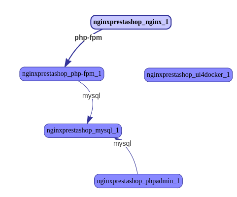

# PrestaShop using Nginx and PHP:FPM with Docker Compose

A dockerized version of [PrestaShop](https://www.prestashop.com/) using [Nginx](https://www.nginx.com/), [PHP FastCGI Process Manager](http://php.net/manual/en/book.fpm.php) and [MySQL](https://www.mysql.com) linked together by [docker-compose](https://docs.docker.com/compose/).

## Installation

*Prerequisite*:
- Docker and Docker-compose on your system.
- You have cloned [this](https://github.com/schlpbch/nginx-prestashop) repository.

Here are the steps to get started:

1. Change into directory:

 ```bash
cd nginx-prestashop
 ```
   Your directory should now look like this:

 ```
.
├── docker-compose-shared.yml
├── docker-compose.yml
├── docker-images
│   ├── mysql
│   │   ├── Dockerfile
│   │   └── my.conf
│   ├── nginx
│   │   ├── Dockerfile
│   │   └── site.conf
│   └── php-fpm
│       └── Dockerfile
├── documentation
│   └── containersNetwork.png
├── install-Nginx-PrestaShop.sh
├── LICENSE
└── README.md
 ```

2. Next download the PrestaShop source and unzip it. The stable version currently is 1.6.1.10.

 ```bash
 # Download the PrestaShop source
 wget https://www.prestashop.com/download/old/prestashop_1.6.1.10.zip

 # Unzip the PrestaShop archive
 unzip prestashop_1.6.1.10.zip

 # Remove zip and install file
 rm prestashop_1.6.1.10.zip Install_PrestaShop.html
 ```

3. Set the correct user and group ownership for the PrestaShop directory (run as root).

 ```bash
sudo chown -R www-data:www-data prestashop/
 ```
Your directory should now look like this:

 ```
    .
    ├── docker-compose.yml
    ├── docker-images
    │   ├── mysql
    │   ├── nginx
    │   └── php-fpm
    ├── documentation
    │   └── ...
    ├── PrestaShop
    │   ├── ...
    ├── install-Nginx-PrestaShop.sh
    ├── LICENSE
    └── README.md
 ```

All the steps are defined in this script [install-Nginx-PrestaShop.sh](install-Nginx-PrestaShop.sh).


## Starting your PrestaShop

1. Set strong passwords in the [docker-compose.yml](docker-compose.yml) file.

 ```yaml
    mysql:
        build: docker-images/mysql
        volumes:
            - ./mysql:/var/lib/mysql
        environment:
            MYSQL_ROOT_PASSWORD: mysql-root-pwd
            MYSQL_USER: mysql-user
            MYSQL_PASSWORD: mysql-pwd
            MYSQL_DATABASE: prestahop
 ```

2. Start your PrestaShop using `docker-compose up`.

3. Follow the installation steps of PrestaShop.

   The MySQL server is running at *172.17.0.3*.

   Do not forget to delete the `install` folder in the PrestaShop directory in the end. As the directory now belongs to 'www-data' switch to that user or run as root:

 ```bash
    sudo rm -r PrestaShop/install
 ```

### Stopping your PrestaShop

To stop your PrestaShop simply type: `docker-compose stop`.

## Containers

### Overview

The dockerized version of your PrestaShop consists of the following containers:

  1. [Nginx](docker-images/nginx/Dockerfile) web server image
  2. [PHP](docker-images/php-fpm/Dockerfile) php:fpm image
  3. [MySQL](docker-images/mysql/Dockerfile) MySQL image
  4. [phpMyAdmin](https://hub.docker.com/r/phpmyadmin/phpmyadmin/) PHP My Admin image (on port 9010)
  5. [UI For Docker](https://hub.docker.com/r/uifd/ui-for-docker/) UI for Docker image (on port 9000). **Added for illustrative purposes only, not needed for production.**

The screen shot below visualizes the setup (sceen shot taken from 'UI For Docker', tab 'Containers Network'):

[](documentation/containersNetwork-png)


### Using different SSL certificates

PBy default dummy certificates are used (see [docker-images/nginx/Dockerfile](docker-images/nginx/Dockerfile)).
If you want to use a different certificate you can override the key and cert with your own certificates. If proper certificates are used **HTTP2** is supported.

### To Do

- Add an example of how to link to an existing MySQL database instance.

### Thanks

Thanks to Andreas Koch for his excellent examples on dockerizing [Magento](https://magento.com/). Have a look at a blog-post of his: [Dockerizing  Magento](https://andykdocs.de/development/Docker/Dockerize-Magento).


## Licensing

nginx-prestashop is licensed under the Apache License, Version 2.0.
See [LICENSE](LICENSE) for the full license text.
